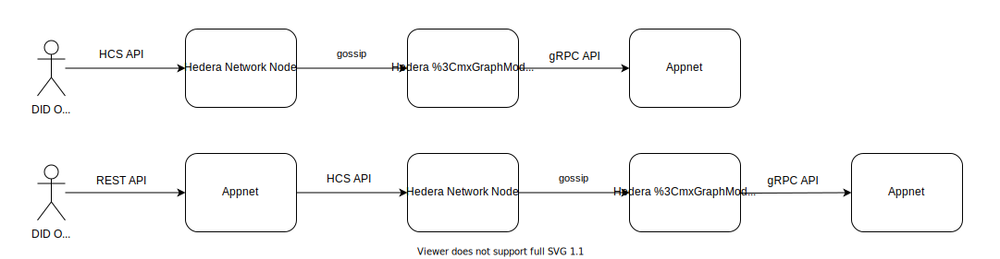
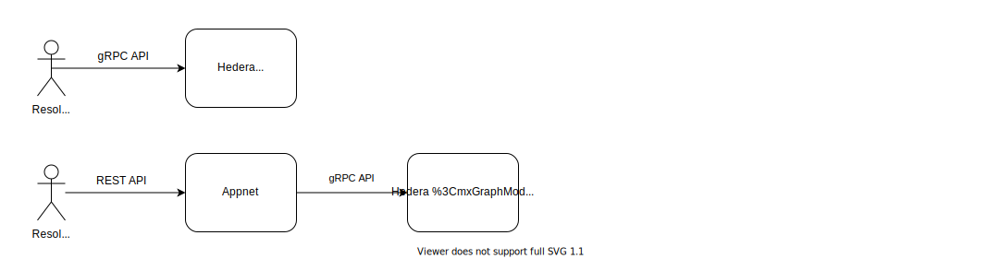

# Hedera Hashgraph DID Method Specification
Version 0.1, Hedera Hashgraph
 
## Table of Contents
- [Hedera Hashgraph DID Method Specification](#hedera-hashgraph-did-method-specification)
  - [Table of Contents](#table-of-contents)
  - [About](#about)
  - [Abstract](#abstract)
  - [Status of This Document](#status-of-this-document)
  - [Motivation](#motivation)
  - [Hedera Hashgraph DID Method](#hedera-hashgraph-did-method)
    - [Namespace Specific Identifier (NSI)](#namespace-specific-identifier-nsi)
      - [Method-Specific DID URL Parameters](#method-specific-did-url-parameters)
        - [Appnet Address Book](#appnet-address-book)
  - [CRUD Operations](#crud-operations)
    - [Create](#create)
    - [Read](#read)
    - [Update](#update)
    - [Delete (Revoke)](#delete-revoke)
    - [Appnet Relay Interface for CRUD Operations](#appnet-relay-interface-for-crud-operations)
      - [Create](#create-1)
      - [Read](#read-1)
      - [Update](#update-1)
      - [Delete (Revoke)](#delete-revoke-1)
  - [Security Considerations](#security-considerations)
  - [Privacy Considerations](#privacy-considerations)
  - [Reference Implementations](#reference-implementations)
  - [References](#references)

## About
This [DID method specification](https://w3c-ccg.github.io/did-spec/#specific-did-method-schemes) conforms to the requirements in the DID specification currently published by the W3C Credentials Community Group. For more information about DIDs and DID method specifications, please see the [DID Primer](https://github.com/WebOfTrustInfo/rwot5-boston/blob/master/topics-and-advance-readings/did-primer.md) and [DID Spec](https://w3c.github.io/did-core/).

The following DID Method will be registered in the [DID Method Registry](https://w3c-ccg.github.io/did-method-registry/).

## Abstract
Hedera Hashgraph is a multi-purpose open public ledger that uses hashgraph consensus - a fast, fair, and secure alternative to blockchains.

## Status of This Document
This document was published as an Editor's Draft.

Publication as an Editor's Draft does not imply endorsement by the W3C Membership. This is a draft document and may be updated, replaced or obsoleted by other documents at any time. It is inappropriate to cite this document as other than a work in progress.

## Motivation
This document defines a binding of the Decentralized Identifier architecture to Hedera Hashgraph - specifically how to use the Hedera File Service to record membership in 'application networks' (appnets) and how to use the Hedera Consensus Service (HCS) for CRUD mechanisms on DID documents stored in such appnets. An appnet is a network of computers that store some set of business data (such as DID Documents) in a shared state, and rely on the Hedera mainnet for timestamping and ordering the transactions that cause that appnet state to change. An appnet could be exclusively dedicated to managing DID Documents and other identity artifacts in its state, or it could itself be multi-purpose. For instance, a Supply Chain could establish an appnet and, in addition to using HCS for tracking the location of shipments, use the DID method defined here to manage the identities of the companies, employees, and IoT devices. The HCS model is designed to off load from the Hedera mainnet node the burden of disk writes and long term storage and so allow those nodes to be optimized for high throughput ordering of transactions. 

## Hedera Hashgraph DID Method
The namestring that shall identify this DID method is: `hedera`

A DID that uses this method MUST begin with the following prefix: `did:hedera`. Per the DID specification, this string MUST be in lowercase. The remainder of the DID, after the prefix, is the NSI specified below.

### Namespace Specific Identifier (NSI)
The `did:hedera` namestring is defined by the following ABNF:
```abnf
hedera-did = "did:hedera:" hedera-specific-idstring ";" hedera-specific-parameters
hedera-specific-idstring = hedera-network ":" hedera-base58-key
hedera-specific-parameters = appnet-address-book [";" appnet-did-topic]
appnet-address-book = "hedera:" hedera-network ":fid=" appnet-address-book-file-id

appnet-did-topic = "hedera:" hedera-network ":tid=" appnet-did-topic-id
appnet-address-book-file-id = 1*DIGIT "." 1*DIGIT "." 1*DIGIT
appnet-did-topic-id = 1*DIGIT "." 1*DIGIT "." 1*DIGIT

hedera-network = "mainnet" / "testnet"
hedera-base58-key = 32*44(base58)
base58 = "1" / "2" / "3" / "4" / "5" / "6" / "7" / "8" / "9" / "A" / "B" /
         "C" / "D" / "E" / "F" / "G" / "H" / "J" / "K" / "L" / "M" / "N" /
         "P" / "Q" / "R" / "S" / "T" / "U" / "V" / "W" / "X" / "Y" / "Z" /
         "a" / "b" / "c" / "d" / "e" / "f" / "g" / "h" / "i" / "j" / "k" /
         "m" / "n" / "o" / "p" / "q" / "r" / "s" / "t" / "u" / "v" / "w" /
         "x" / "y" / "z"
```

Example:
```
did:hedera:mainnet:7Prd74ry1Uct87nZqL3ny7aR7Cg46JamVbJgk8azVgUm;hedera:mainnet:fid=0.0.123
```

The method specific identifier `hedera-specific-idstring` is composed of a Hedera network identifier with a `:` separator followed by a `hedera-base58-key` identifier which is a base58-encoded SHA-256 hash of a DID root public key and then method specific parameters `fid` and optionally `tid` (see details below). 

Hedera DIDs are not required to be registered on the ledger and may be used as unregistered pseudonymous pairwise identifiers. However, these identifiers may also be registered on the ledger within a specific appnet and be publicly resolvable or with access restriction defined by appnet owners. 

Every DID document registered on Hedera network MUST contain a public key of id `#did-root-key` and type `Ed25519VerificationKey2018`. The `hedera-base58-key` identifier is a base58-encoded SHA-256 hash of this public key.

Example Hedera DID document:
```json
{
  "@context": "https://www.w3.org/ns/did/v1",
  "id": "did:hedera:mainnet:7Prd74ry1Uct87nZqL3ny7aR7Cg46JamVbJgk8azVgUm;hedera:mainnet:fid=0.0.123",
  "authentication": [
    "did:hedera:mainnet:7Prd74ry1Uct87nZqL3ny7aR7Cg46JamVbJgk8azVgUm;hedera:mainnet:fid=0.0.123#did-root-key"
  ],
  "publicKey": [
    {
      "id": "did:hedera:mainnet:7Prd74ry1Uct87nZqL3ny7aR7Cg46JamVbJgk8azVgUm;hedera:mainnet:fid=0.0.123#did-root-key",
      "type": "Ed25519VerificationKey2018",
      "controller": "did:hedera:mainnet:7Prd74ry1Uct87nZqL3ny7aR7Cg46JamVbJgk8azVgUm;hedera:mainnet:fid=0.0.123",
      "publicKeyBase58": "H3C2AVvLMv6gmMNam3uVAjZpfkcJCwDwnZn6z3wXmqPV"
    }
  ],
  "service": [
    {
      "id": "did:hedera:mainnet:7Prd74ry1Uct87nZqL3ny7aR7Cg46JamVbJgk8azVgUm;hedera:mainnet:fid=0.0.123#vcs",
      "type": "VerifiableCredentialService",
      "serviceEndpoint": "https://example.com/vc/"
    }
  ]
}
```

#### Method-Specific DID URL Parameters
There are two method-specific parameters defined for a Hedera DID:
- `fid` - a mandatory parameter that defines the FileID of a the corresponding appnet's address book file. The first step in resolving a DID is to retrieve the address book from the Hedera network, and so determine the addresses of the members of the appnet against which the second step of resolution can be performed. 
- `tid` - an optional parameter that defines a TopicID of Hedera Consensus Service topic to which a particular DID document was submitted. This can be used in case of open and publicly available DID documents to resolve DIDs without the use of appnet services.

A Hedera FileID is a triplet of numbers, e.g. `1.5.34634` represents file number `34634` within realm `5` within shard `1`.
Hedera TopicID follows a similar format and is defined as a triplet of numbers, e.g. `0.0.21243` represents a topic identifier `21243` within realm `0` within shard `0`.

##### Appnet Address Book
Each appnet that utilizes the Hedera DID Method must create and manage an address book file stored in the Hedera File Service. Unlike DID Documents which are persisted in an appnet's state, appnet address books are persisted in the state of the Hedera network nodes on the file service. The Hedera network consequently provides a decentralized and trusted discovery mechanism for appnet address books. The address book file contains URLs of the indivodual servers that comprise the appnet and that provide CRUD services for the DIDs within this appnet and Topic IDs within Hedera network used for posting DID and verifiable credentials. The address book is a JSON file compatible with a JSON schema defined [here](appnet-address-book.schema.json). 

Example address book file content:
```json
{
	"appnetName": "My AppNet",
	"didTopicId": "0.0.12345",
	"vcTopicId": "0.0.23456",
	"appnetDIDServers": [
		"https://example.com/myappnet/hedera/api", 
		"https://example2.com/myappnet/api/v1", 
		"https://example3.com/myappnet"
	]
}
```

## CRUD Operations
Hedera network nodes support a Consensus Service API by which clients submit transaction messages to a topic - these transactions assigned a consensus timestamp and order before flowing back out to mirror nodes and any appnets subscribed to the relevamt topic. Every appnet that implements the Hedera DID method must have a dedicated HCS topic created for DID documents registration. Members of the appnet will subscribe to the corresponding topics, and consesequently retrieve and store valid DID documents submitted to the topic. 

Create, Update and Delete operations against a DID Document are submitted via the Consensus Service API, either directly by a DID Owner or indirectly by an appnet member on behalf of a DID Owner

The two alternatives are:


The Read operation happens against either a mirror node or a member of the relevant appnet for the DID in question.

The two alternatives are:


A valid CRUD message must have a JSON structure defined by a [did-message-schema](did-message.schema.json) and contains the following properties:
- `didOperation` - Operation to be performed on the DID document. Valid values are: `create`, `update` and `delete`.
- `mode` - Describes the mode in which DID document is provided in this message. Valid values are: `plain` or `encrypted`.
- `did` -  - This field may contain either: 
  - a plain DID,
  - or an encrypted representation of the DID, where the encryption and decryption methods and keys are defined by appnet owners.
- `didDocumentBase64` - This field may contain either: 
  - a string that represents Base64-encoded plain DID document that conforms to the [DID Specification](https://w3c.github.io/did-core/),
  - or an encrypted representation of this Base64 string, where the encryption and decryption methods and keys are defined by appnet owners.
- `signature` - A signature that is a result of signing a string that represents Base64-encoded plain DID document with a private key corresponding to the public key `#did-root-key` in the DID document.

Neither the Hedera network nor mirror nodes validate the DID Documents against the above requirements - it is appnets that, as part of their subscription logic, must validate DID Documents based on the above criteria.

Here is an example message content:
```json
{
  "didOperation": "create",
  "mode": "plain",
  "did": "did:hedera:mainnet:7Prd74ry1Uct87nZqL3ny7aR7Cg46JamVbJgk8azVgUm;hedera:mainnet:fid=0.0.123",
  "didDocumentBase64": "ewogICJAY29udGV...9tL3ZjLyIKICAgIH0KICBdCn0=",
  "signature":  "QNB13Y7Q9...1tzjn4w=="
}
```

It is a responsibility of an appnet's administrators to decide who can submit messages to their DID topic. Access control of message submission is defined by a `submitKey` property of `ConsensusCreateTopicTransaction` body. If no `submitKey` is defined for a topic, then any party can submit messages against the topic. Detailed information on Hedera Consensus Service APIs can be found in the official [Hedera API documentation](https://docs.hedera.com/hedera-api/consensus/consensusservice).

### Create
A DID document is created within a particular appnet by sending a `ConsensusSubmitMessage` transaction to a Hedera network node. It is executed by sending a `submitMessage` RPC call to the HCS API with the `ConsensusSubmitMessageTransactionBody` containing:
- `topicID` - equal to the ID of appnet's DID topic
- `message` - a JSON DID message described above with `didOperation` set to `create`

Appnet members subscribed to this DID topic shall store the DID document in their local upon receiving this message from a mirror.

### Read
Read, or DID resolution, does not occur via HCS messages but rather directly against a node that has persisted the DID Document.

How resolution of a DID into the corresponding DID Document occurs depends on whether the DID Document was submitted in encrypted or plaintext mode and, where resolution happens.

If submitted in plaintext mode, then resolution can occur either against a mirror node that may have persisted the history of messages for that DID Document, or against a member of the appnet that persisted the DID Document.

If resolved against a mirror, resolution requires reading the latest transaction message submitted to a DID topic for the given DID and checking if there was no earlier transaction for this DID with `didOperation` set to `delete`. This method can only be executed on a mirror node and may require reading a full history of messages in the topic. edera mirror nodes provide a [Hedera Consensus Service gRPC API](https://docs.hedera.com/guides/docs/mirror-node-api/hedera-consensus-service-api-1). Client applications can use this API to subscribe to an appnet's DID topic to receive DID messages submitted to it and filter those that contain the DID to be resolved. 

Here is an example Java client, please refer to the official Hedera documentation for more information:
```java
new MirrorConsensusTopicQuery()
    .setTopicId(didTopicId)
    .subscribe(mirrorClient, resp -> {
          String didMessage = new String(resp.message, StandardCharsets.UTF_8);
          System.out.println(resp.consensusTimestamp + " received DID message: " + didMessage);
      },
      // On gRPC error, print the stack trace
      Throwable::printStackTrace);
    });
```

If resolved against an appnet member, resolution requires calling appnet relay service (defined below). 

If the DID Document were submitted in encrypted mode, then resolution against a mirror is not possible unless the verifier is in possession of a decryption key and the appnet service is the only way of resolution.


### Update
A DID document is updated within the appnet by sending a `ConsensusSubmitMessage` transaction to a Hedera network node. It is executed by sending a `submitMessage` RPC call to HCS with the `ConsensusSubmitMessageTransactionBody` containing:
- `topicID` - equal to the ID of the appropriate appnet's DID topic
- `message` - a JSON DID message described above with `didOperation` set to `update`

Appnet members subscribed to this DID topic shall replace the previous version of the DID document from their storage with this new version upon receiving this message from a mirror.

### Delete (Revoke)
A DID document is deleted within the appnet by sending a `ConsensusSubmitMessage` transaction to a Hedera network node. It is executed by sending a `submitMessage` RPC call to HCS with the `ConsensusSubmitMessageTransactionBody` containing:
- `topicID` - equal to the ID of appnet's DID topic
- `message` - a JSON DID message described above with `didOperation` set to `delete`

Appnet members subscribed to this DID topic shall delete the DID document from their storage or mark it as revoked upon receiving this message from a mirror.

### Appnet Relay Interface for CRUD Operations

DID Controllers, who have their own accounts on the Hedera network and are authorized to submit messages to an appnet's DID topic can send Create, Update, and Delete HCS transactions directly to a Hedera network node. Alternatively, DID Controllers can use an appnet's relay interface that will send the HCS messages for them. The access to an appnet's CRUD relay interface is defined by each appnet owner, so authentication and authorization mechanisms are out of scope. This specification only defines a common REST API interface for each CRUD operation. The interface path is relative to the service URLs defined in the appnet's address book file.

All API operations shall have the same error response content as the following example:
```json
{
  "error" : {
    "code" : 404,
    "message" : "You are unauthorized to make this request."
  }
}
```

#### Create
Requests that a new DID document be created on the appnet network.

The DID Document is not considered to have been created until the DID Document was submitted to the HCS, received a consensus timestamp and order , been retrieved by the members of the appropriate appnet, and persisted in the appnet state.

The mode in which the DID document is submitted (plain or encrypted) is defined on the appnet level and shall be transparent to the API users.

- __URL:__ `/did/`
- __Method:__ `POST`
- __Content Type:__ `application/json`
- __URL Parameters:__ *None*
- __Request Body:__
```json
{
  "did": "did:hedera:mainnet:7Prd74ry1Uct87nZqL3ny7aR7Cg46JamVbJgk8azVgUm;hedera:mainnet:fid=0.0.123",
  "didDocumentBase64": "ewogICJAY29udGV...9tL3ZjLyIKICAgIH0KICBdCn0=",
  "signature": "QNB13Y7Q9...1tzjn4w=="
}
```
- __Success Response:__
  - __Code:__ `200 OK`
- __Error Response:__
  - __Code:__ `401 UNAUTHORIZED`
  - __Code:__ `500 INTERNAL SERVER ERROR`

#### Read
Resolves a given DID into the corresponding full DID document.

- __URL:__ `/did/`
- __Method:__ `GET`
- __Content Type:__ `application/json`
- __URL Parameters:__ *None*
- __Request Body:__
```json
{
  "did": "did:hedera:mainnet:7Prd74ry1Uct87nZqL3ny7aR7Cg46JamVbJgk8azVgUm;hedera:mainnet:fid=0.0.123",
}
```
- __Success Response:__
  - __Code:__ `200 OK`
  - __Response Body:__
The latest version of DID document in a plain form, e.g.:
```json
{
  "@context": "https://www.w3.org/ns/did/v1",
  "id": "did:hedera:mainnet:7Prd74ry1Uct87nZqL3ny7aR7Cg46JamVbJgk8azVgUm;hedera:mainnet:fid=0.0.123",
  "authentication": [
    "did:hedera:mainnet:7Prd74ry1Uct87nZqL3ny7aR7Cg46JamVbJgk8azVgUm;hedera:mainnet:fid=0.0.123#did-root-key"
  ],
  "publicKey": [
    {
      "id": "did:hedera:mainnet:7Prd74ry1Uct87nZqL3ny7aR7Cg46JamVbJgk8azVgUm;hedera:mainnet:fid=0.0.123#did-root-key",
      "type": "Ed25519VerificationKey2018",
      "controller": "did:hedera:mainnet:7Prd74ry1Uct87nZqL3ny7aR7Cg46JamVbJgk8azVgUm;hedera:mainnet:fid=0.0.123",
      "publicKeyBase58": "H3C2AVvLMv6gmMNam3uVAjZpfkcJCwDwnZn6z3wXmqPV"
    }
  ],
  "service": [
    {
      "id": "did:hedera:mainnet:7Prd74ry1Uct87nZqL3ny7aR7Cg46JamVbJgk8azVgUm;hedera:mainnet:fid=0.0.123#vcs",
      "type": "VerifiableCredentialService",
      "serviceEndpoint": "https://example.com/vc/"
    }
  ]
}
```

- __Error Response:__
  - __Code:__ `401 UNAUTHORIZED`
  - __Code:__ `404 NOT FOUND`
  - __Code:__ `500 INTERNAL SERVER ERROR`

#### Update
Requests that the DID document be updated on the appnet network.

The DID Document is not considered to have been updated until the DID Document was submitted to the HCS, received a consensus timestamp and order , been retrieved by the members of the appropriate appnet, and persisted in the appnet state.

- __URL:__ `/did/`
- __Method:__ `PUT`
- __Content Type:__ `application/json`
- __URL Parameters:__ *None*
- __Request Body:__
```json
{
  "did": "did:hedera:mainnet:7Prd74ry1Uct87nZqL3ny7aR7Cg46JamVbJgk8azVgUm;hedera:mainnet:fid=0.0.123",
  "didDocumentBase64": "ewogICJAY29udGV...9tL3ZjLyIKICAgIH0KICBdCn0=",
  "signature": "QNB13Y7Q9...1tzjn4w=="
}
```
- __Success Response:__
  - __Code:__ `200 OK`
- __Error Response:__
  - __Code:__ `401 UNAUTHORIZED`
  - __Code:__ `404 NOT FOUND`
  - __Code:__ `500 INTERNAL SERVER ERROR`

#### Delete (Revoke)
Requests that a given DID Document be deleted or revoked from the appnet network. The DID document submitted here should have at least `authentication` part empty, so that any subsequent DID ownership verification will fail.

The DID Document is not considered to have been deleted until the DID Document was submitted to the HCS, received a consensus timestamp and order, been retrieved by the members of the appropriate appnet, and persisted in the appnet state.

Depending on an appnet's storage implementation the DID document may be completely removed or instead only marked as revoked.

- __URL:__ `/did/`
- __Method:__ `DELETE`
- __Content Type:__ `application/json`
- __URL Parameters:__ *None*
- __Request Body:__
```json
{
  "did": "did:hedera:mainnet:7Prd74ry1Uct87nZqL3ny7aR7Cg46JamVbJgk8azVgUm;hedera:mainnet:fid=0.0.123",
  "didDocumentBase64": "ewogICJAY29udGV...9tL3ZjLyIKICAgIH0KICBdCn0=",
  "signature": "QNB13Y7Q9...1tzjn4w=="
}
```
- __Success Response:__
  - __Code:__ `200 OK`
- __Error Response:__
  - __Code:__ `401 UNAUTHORIZED`
  - __Code:__ `404 NOT FOUND`
  - __Code:__ `500 INTERNAL SERVER ERROR`

## Security Considerations

Security of Hedera DID Documents inherits the security properties of Hedera Hashgraph network itself and specific implementation of appnets that persist the DID Documents.

Hedera Hashgraph uses the hashgraph algorithm for the consensus timestamping and ordering of transactions. Hashgraph is Asynchronous Byzantine Fault Tolerant (ABFT) and fair, in that no particular node has the sole authority to decide the order of transactions, even if only for a short period of time. 

Hedera is a proof of stake model to mitigate Sybil attacks. 

Hedera charges fees for the processing of transactions into consensus and to partially mitigate Denial of Service attacks.

In the HCS model, messages are submitted to the Hedera network nodes, which collectively assign them a consensus timestamp and order within a topic, and then are deleted from those network consensus nodes. Consensus network nodes do not persist HCS messages beyond 3 minutes.

The messages are persisted only on mirror nodes, and appnet members that are subscribed to the corresponding topic.

Mirrors may persist HCS messages and are presumed to be public. Consequently, any data sent via HCS messages should be encrypted if sensitive. 

A public DID Document can be sent unencrypted. Public DIDs/DID Documents include public keys and service endpoints

If it be undesirable that a DID Document be public, it can be encrypted such that only members of an appnet can read it, or even specific members of the appnet. HCS supports perfect forward secrecy through key rotation to mitigate the risk of encrypted DID Documents persisted on mirrors being decrypted. 

Regardless of encryption, a DID Document should not include PII.

Write access to Hedera Consensus Service DID Topics can be controlled by stipulating a list of public keys for the topic by appnet administrators. Only HCS messages signed by the corresponding private keys will be accepted. A key can be a "threshold key", which means a list of M keys, any N of which must sign in order for the threshold signature to be considered valid. The keys within a threshold signature may themselves be threshold signatures, to allow complex signature requirements. 


## Privacy Considerations

TBD

- correlation risk
- point to encryption of DID Documents


## Reference Implementations
The code at [https://github.com/hashgraph/Identity-sdk](https://github.com/hashgraph/Identity-sdk) is intended to provide a Java SDK for this DID method specification. A set of unit tests within this repository presents a reference implementation of this DID method.

## References
* <https://w3c-ccg.github.io/did-spec/>
* <https://github.com/hashgraph/Identity-sdk> 
* <https://docs.hedera.com/hedera-api/>
* <https://www.hedera.com/>
