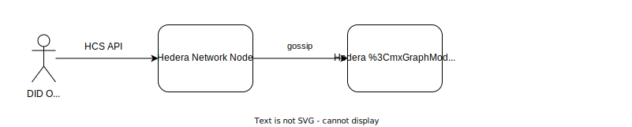
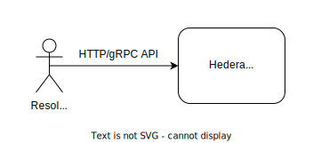

% Hedera Hashgraph DID Method Specification
% Authors: Paul Madsen, Jo Vercammen, Derek Munneke
% Version: 1.0-draft-2024-01-12
<!-- [pandoc `title block`](https://pandoc.org/MANUAL.html#extension-pandoc_title_block) -->

**Table of Contents** 

- [1. About](#1-about)
  - [1.1. Status of This Document](#11-status-of-this-document)
  - [1.2. About Hedera Hashgraph](#12-about-hedera-hashgraph)
  - [1.3. Motivation](#13-motivation)
- [2. Hedera Hashgraph DID Method](#2-hedera-hashgraph-did-method)
  - [2.1. Namespace Specific Identifier (NSI)](#21-namespace-specific-identifier-nsi)
  - [2.2. Method-Specific DID URL Parameters](#22-method-specific-did-url-parameters)
- [3. CRUD Operations](#3-crud-operations)
  - [3.1. Operations](#31-operations)
    - [3.1.1. Create](#311-create)
    - [3.1.2. Read](#312-read)
    - [3.1.3. Update](#313-update)
    - [3.1.4. Revoke](#314-revoke)
    - [3.1.5. Delete](#315-delete)
  - [3.2. Event Payload](#32-event-payload)
    - [3.2.1. DID Document](#321-did-document)
    - [3.2.2. DID Owner](#322-did-owner)
    - [3.2.3. Verification Method](#323-verification-method)
    - [3.2.4. Verification Relationship](#324-verification-relationship)
    - [3.2.5. Services](#325-services)
- [4. Security Considerations](#4-security-considerations)
- [5. Privacy Considerations](#5-privacy-considerations)
- [6. Reference Implementations](#6-reference-implementations)
- [7. References](#7-references)

# 1. About

The Hedera DID method specification conforms to the requirements of the [Decentralized Identifiers (DIDs) v1.0](https://www.w3.org/TR/2022/REC-did-core-20220719/) [W3C Recommendation](https://www.w3.org/standards/types#REC), published 19 July 2022. 

The following DID Method is registered in the [DID Method Registry](https://w3c-ccg.github.io/did-method-registry/).

## 1.1. Status of This Document

This document is published as a Draft for feedback.

## 1.2. About Hedera Hashgraph

[Hedera](https://hedera.com/) [Hashgraph](https://github.com/hashgraph) is a multi-purpose open public ledger that uses hashgraph consensus - a fast, fair, and secure alternative to blockchains.

## 1.3. Motivation

This document defines a binding of the Decentralized Identifier architecture to Hedera Hashgraph - specifically how to use the Hedera Consensus Service (HCS) for CRUD mechanisms to construct and resolve a DID document from a DID. 

# 2. Hedera Hashgraph DID Method

The namestring that shall identify this DID method is: `hedera`

A DID that uses this method MUST begin with the following prefix: `did:hedera`. Per the DID specification, this string MUST be in lowercase. The remainder of the DID, after the prefix, is the NSI specified below.

## 2.1. Namespace Specific Identifier (NSI)

The `did:hedera` namestring is defined by the following ABNF:

```abnf
hedera-did = "did:hedera:" hedera-specific-idstring "_" hedera-specific-parameters
hedera-specific-idstring = hedera-network ":" hedera-base58-key
hedera-specific-parameters = did-topic-id
did-topic-id = 1*DIGIT "." 1*DIGIT "." 1*DIGIT

hedera-network = "mainnet" / "testnet"
hedera-base58-key = 32*44(base58)
base58 = "1" / "2" / "3" / "4" / "5" / "6" / "7" / "8" / "9" / "A" / "B" /
         "C" / "D" / "E" / "F" / "G" / "H" / "J" / "K" / "L" / "M" / "N" /
         "P" / "Q" / "R" / "S" / "T" / "U" / "V" / "W" / "X" / "Y" / "Z" /
         "a" / "b" / "c" / "d" / "e" / "f" / "g" / "h" / "i" / "j" / "k" /
         "m" / "n" / "o" / "p" / "q" / "r" / "s" / "t" / "u" / "v" / "w" /
         "x" / "y" / "z"
```

Example:

```text
did:hedera:mainnet:z52k2w6rFF9xxzvmSiuyqwJS8b7oFnDtk8S3bhY4YbnJq_0.0.3474905
```

The method specific identifier `hedera-specific-idstring` is composed of a Hedera network identifier with a `:` separator followed by a `hedera-base58-key` identifier which is a base58 Encoded of a DID root public key and a `did-topic-id` (see details below).

Every DID document registered on Hedera network MUST contain a public key of id `#did-root-key` and type `Ed25519VerificationKey2018`. The `hedera-base58-key` identifier is a base58 Encoded of this public key.

Example Hedera DID document:

```json
{
  "@context": "https://www.w3.org/ns/did/v1",
  "id": "did:hedera:testnet:z5pFuTLEhRXiMiWVb1MxBm5ZJNVNVqTgumeMboAy3fCpd_0.0.645701",
  "verificationMethod": [
    {
      "id": "did:hedera:testnet:z5pFuTLEhRXiMiWVb1MxBm5ZJNVNVqTgumeMboAy3fCpd_0.0.645701#did-root-key",
      "type": "Ed25519VerificationKey2018",
      "controller": "did:hedera:testnet:z5pFuTLEhRXiMiWVb1MxBm5ZJNVNVqTgumeMboAy3fCpd_0.0.645701",
      "publicKeyBase58": "5pFuTLEhRXiMiWVb1MxBm5ZJNVNVqTgumeMboAy3fCpd"
    },
    {
      "id": "did:hedera:testnet:z87meAWt7t2zrDxo7qw3PVTjexKWReYWS75LH29THy8kb_0.0.29617801#key-1",
      "type": "Ed25519VerificationKey2018",
      "controller": "did:hedera:testnet:z5pFuTLEhRXiMiWVb1MxBm5ZJNVNVqTgumeMboAy3fCpd_0.0.645701",
      "publicKeyBase58": "AvU2AEh8ybRqNwHAM3CjbkjYaYHpt9oA1uugW9EVTg6P"
    }
  ],
  "assertionMethod": [
    "did:hedera:testnet:z5pFuTLEhRXiMiWVb1MxBm5ZJNVNVqTgumeMboAy3fCpd_0.0.645701#did-root-key"
  ],
  "authentication": [
    "did:hedera:testnet:z5pFuTLEhRXiMiWVb1MxBm5ZJNVNVqTgumeMboAy3fCpd_0.0.645701#did-root-key",
    "did:hedera:testnet:z87meAWt7t2zrDxo7qw3PVTjexKWReYWS75LH29THy8kb_0.0.29617801#key-1"
  ],
  "service": [
    {
      "id": "did:hedera:testnet:z6MkubW6fwkWSA97RbKs17MtLgWGHBtShQygUc5SeHueFCaG_0.0.29656231#service-1",
      "type": "LinkedDomains",
      "serviceEndpoint": "https://test.com/did"
    }
  ]
}
```

## 2.2. Method-Specific DID URL Parameters

There is one method-specific parameter defined for a Hedera DID:

- `did-topic-id` - an mandatory parameter that defines a TopicID of Hedera Consensus Service topic to which a particular DID document was submitted. This allow us to resolve DIDs publicly through Hedera mirror nodes.

A Hedera TopicID is a triplet of numbers, e.g. `0.0.29656231` represents a topic identifier `29656231` within realm `0` within shard `0`.

Realms allow Solidity smart contracts to run in parallel. Realms are not relevant to this DID Method. In the future, when the number of consensus nodes warrants, the Hedera network will be divided up into shards such that a particular transaction will be processed into consensus only by a subset of the full set of nodes.

# 3. CRUD Operations

Create, Update and Delete operations against a DID Document are submitted via a Consensus Service (HCS) message.



The Read operation for resolution of a DID document from a DID happens against a mirror node.



A valid Create, Update, Revoke or Delete message must have a JSON structure defined by a [DIDMessage-schema](DIDMessage.schema.json) and contains the following properties:

- `message` - The message content with the following attributes:
  - `operation` - DID method operation to be performed on the DID document. Valid values are: `create` , `update` , `revoke` and `delete`.
  - `did` - a hedera DID namestring.
  - `event` - A Base64-encoded list of events in JSON notation that conforms the different properties of a DID documents to the [DID Specification](https://w3c.github.io/did-core/), the accepted events are listed within this specification.
  - `timestamp` - A message creation time. The value MUST be a valid XML datetime value, as defined in section 3.3.7 of [W3C XML Schema Definition Language (XSD) 1.1 Part 2: Datatypes](https://www.w3.org/TR/xmlschema11-2/). This datetime value MUST be normalized to UTC 00:00, as indicated by the trailing "Z". It is important to note that this timestamp is a system timestamp as a variable part of the message and does not represent a consensus timestamp of a message submitted to the DID topic.
- `signature` - A Base64-encoded signature that is a result of signing a minified JSON string of a message attribute with a private key corresponding to the public key `#did-root-key` in the DID document.

Neither the Hedera network nor mirror nodes validate the DID Documents against the above requirements - it is business application network members that, as part of their subscription logic, must validate DID Documents based on the above criteria. The messages with duplicate signatures shall be disregarded and only the first one with verified signature is valid (in consensus timestamp order).

Here is an example of a complete message wrapped in an envelope and signed:

```json
{
  "message": {
    "operation": "update",
    "did": "did:hedera:mainnet:7Prd74ry1Uct87nZqL3ny7aR7Cg46JamVbJgk8azVgUm_0.0.12345", 
    "event": "ewogICJAY29udGV...9tL3ZjLyIKICAgIH0KICBdCn0=",
    "timestamp": "2020-04-23T14:37:43.511Z"
  },
  "signature":  "QNB13Y7Q9...1tzjn4w=="
}
```

It is a responsibility of a DID Controller to decide who can submit messages to their DID topic. Access control of message submission is defined by a `submitKey` property of `ConsensusCreateTopicTransaction` body. If no `submitKey` is defined for a topic, then any party can submit messages against the topic. Detailed information on Hedera Consensus Service APIs can be found in the official [Hedera API documentation](https://docs.hedera.com/hedera-api/consensus/consensusservice).

## 3.1. Operations

### 3.1.1. Create

A DID is created by sending a `ConsensusSubmitMessage` transaction to a Hedera network node. It is executed by sending a `submitMessage` RPC call to the HCS API with the `ConsensusSubmitMessageTransactionBody` containing:

- `topicID` - equal to the `did-topic-id` element of the DID namestring.
- `message` - a JSON DID message envelope described above
  - `operation` set to `create`
  - `event` payload either a `DIDOwner` or `DIDDocument` object

### 3.1.2. Read

Read, or Resolve, occurs by reading messages from the HCS topic set in the `did-topic-id` element of the DID namestring, and processing messages as below:

1. If the most recent valid message has `operation` set to `delete`, the DID document returned MUST be empty.
2. If the most recent valid message has `operation` set to `create`, and event object is `DIDDocument`, the DID document returned is the document resolve from the IPFS CID reference.
3. Otherwise
   1. Read valid message until one has `operation` set to `create`, and event object is `DIDOwner`.
   2. Construct DID document by applying message `update` and `revoke` operations in order.
   3. Return constructed DID document.

### 3.1.3. Update

A property or a DID document is updated by sending a `ConsensusSubmitMessage` transaction to a Hedera network node. It is executed by sending a `submitMessage` RPC call to HCS with the `ConsensusSubmitMessageTransactionBody` containing:

- `topicID` - equal to the `did-topic-id` element of the DID namestring.
- `message` - a JSON DID message envelope described above
  - `operation` set to `update`
  - `event` payload either a `Service`, `VerificationMethod` or `VerificationRelationship` object

### 3.1.4. Revoke

A property or a DID document is updated by sending a `ConsensusSubmitMessage` transaction to a Hedera network node. It is executed by sending a `submitMessage` RPC call to HCS with the `ConsensusSubmitMessageTransactionBody` containing:

- `topicID` - equal to the `did-topic-id` element of the DID namestring.
- `message` - a JSON DID message envelope described above
  - `operation` set to `revoke`
  - `event` payload either a `Service`, `VerificationMethod` or `VerificationRelationship` object with `id` set to the property to remove.

### 3.1.5. Delete

A Whole DID document is deleted/nullified by sending `ConsensusSubmitMessage` transaction to a Hedera network node. It is executed by sending a `submitMessage` RPC call to HCS with the `ConsensusSubmitMessageTransactionBody` containing:

- `topicID` - equal to the `did-topic-id` element of the DID namestring.
- `message` - a JSON DID message envelope described above
  - `operation` set to `revoke`
  - `event` payload will be ignored

## 3.2. Event Payload

A Base64-encoded JSON object that conforms the different properties of a DID documents to the [DID Specification](https://w3c.github.io/did-core/), the accepted events are listed within this section.

### 3.2.1. DID Document

A Hedera DID MAY be created by creating a reference to a DID document available in [IPFS](https://ipfs.io/).

`DIDDocument` event value must have a JSON structure defined by a [DIDDocument-schema](DIDDocument.schema.json) and contains the following properties:

- `DIDDocument` - The DIDOwner event with the following attributes:
  - `id` - The DID id
  - `type` - The document type, MAY include the DID document serialisation representation.
  - `cid` - The Content Identifiers to point to DID document in IPFS.
  - `url` - A URL to the IPFS document MAY be included for convenience.

```json
{
  "DIDDocument": {
    "id": "did:hedera:testnet:z6MknSnvSESWvijDEysG1wHGnaiZSLSkQEXMECWvXWnd1uaJ_0.0.1723780",
    "type": "DIDDocument",
    "cid": "bafybeifn6wwfs355md56nhwaklgr2uvuoknnjobh2d2suzsdv6zpoxajfa/did-document.json",
    "url": "https://ipfs.io/ipfs/bafybeifn6wwfs355md56nhwaklgr2uvuoknnjobh2d2suzsdv6zpoxajfa/did-document.json"
  }
}
```

### 3.2.2. DID Owner

Each identifier always has a controller address. By default, it is the same as the identifier address, however the resolver must validate this against the DID document. This controller address must be represented in the DID document as a verificationMethod entry with the id set as the DID being resolved and with the fragment `#did-root-key` appended to it. A reference to it must also be added to the authentication and assertionMethod arrays of the DID document.

If the controller for a particular DID is changed, a `DIDOwner` event is emitted through an DID update message. The event data MUST be used to update the `#did-root-key` entry in the verificationMethod array.

`DIDOwner` event must have a JSON structure defined by a [DIDOwner-schema](DIDOwner.schema.json) and contains the following properties:

- `DIDOwner` - The DIDOwner event with the following attributes:
  - `id` - The Id property of the verification method.
  - `type` - reference to the verification method type.
  - `controller` - The DID of the entity that is authorized to make the change.
  - `publickeyMultibase` - Mutlibase encoded public key.

```json
{
  "DIDOwner": {
    "id": "did:hedera:mainnet:7Prd74ry1Uct87nZqL3ny7aR7Cg46JamVbJgk8azVgUm_0.0.12345",
    "type": "Ed25519VerificationKey2018", 
    "controller": "did:hedera:mainnet:a06295ce870b07029bfcdb2dce28d959f2815b16f81798",
    "publicKeyMultibase": "H3C2AVvLMv6gmMNam3uVAjZpfkcJCwDwnZn6z3wXmqPV",
  }
}
```

### 3.2.3. Verification Method

A DID document can express verification methods, such as cryptographic public keys, which can be used to authenticate or authorize interactions with the DID subject or associated parties.

VerificationMethod event must have a JSON structure defined by a [VerificationMethod-schema](VerificationMethod.schema.json) and contains the following properties:

- `VerificationMethod` - The VerificationMethod event with the following attributes:
  - `id` - The Id property of the verification method.
  - `type` - reference to the verification method type.
  - `controller` - The DID of the entity that is authorized to make the change.
  - `publickeyMultibase` - Mutlibase encoded public key.

```json
{
  "VerificationMethod": {
    "id":"did:hedera:mainnet:7Prd74ry1Uct87nZqL3ny7aR7Cg46JamVbJgk8azVgUm_0.0.12345#delegate-key1",
    "type": "Ed25519VerificationKey2018", 
    "controller": "did:hedera:mainnet:7Prd74ry1Uct87nZqL3ny7aR7Cg46JamVbJgk8azVgUm_0.0.12345",
    "publicKeyMultibase": "H3C2AVvLMv6gmMNam3uVAjZpfkcJCwDwnZn6z3wXmqPV",
  },
}
```

### 3.2.4. Verification Relationship

A verification relationship expresses the relationship between the DID subject and a verification method.

Different verification relationships enable the associated verification methods to be used for different purposes. Several useful verification relationship include:

- `authentication` verification relationship is used to specify how the DID subject is expected to be authenticated, for purposes such as logging into a website or engaging in any sort of challenge-response protocol. 
- `assertionMethod` verification relationship allows verifier to check if a verifiable credential contains a proof created by the DID subject.
- `keyAgreement` verification relationship allows the DID subject to specify how an entity can generate encryption material in order to transmit confidential information, such as for the purposes of establishing a secure communication channel with the recipient.
- `capabilityInvocation` verification relationship allows the DID subject to invoke a cryptographic capability for a specific authorisation.
- `capabilityDelegation` verification relationship is used to specify a mechanism that might be used by the DID subject to delegate a cryptographic capability to another party, such as delegating the authority to access a specific HTTP API to a subordinate.

`VerificationRelationship` event must have a JSON structure defined by a [VerificationRelationship-schema](VerificationRelationship.schema.json) and contains the following properties:

- `VerificationRelationship` - The VerificationRelationship event with the following attributes:
  - `id` - The Id property of the verification method.
  - `relationshipType` - Relationship type that is linked to specific verification method. to be performed on the DID document.  Valid values are: `authentication` , `assertionMethod` , `keyAgreement` , `capabilityInvocation` and `capabilityDelegation`.
  - `type` - reference to the verification method type.
  - `controller` - The DID of the entity that is authorized to make the change.
  - `publickeyMultibase` - Multibase encoded public key.

```json
{
  "VerificationRelationship": {
    "id":"did:hedera:mainnet:7Prd74ry1Uct87nZqL3ny7aR7Cg46JamVbJgk8azVgUm_0.0.12345#delegate-key1",
    "relationshipType": "authentication",
    "type": "Ed25519VerificationKey2018", 
    "controller": "did:hedera:mainnet:7Prd74ry1Uct87nZqL3ny7aR7Cg46JamVbJgk8azVgUm_0.0.12345",
    "publicKeyMultibase": "H3C2AVvLMv6gmMNam3uVAjZpfkcJCwDwnZn6z3wXmqPV",
  },
}
```

### 3.2.5. Services

Services are used in DID documents to express ways of communicating with the DID subject or associated entities. A service can be any type of service the DID subject wants to advertise, including decentralized identity management services for further discovery, authentication, authorization, or interaction.

Service event must have a JSON structure defined by a [service-schema](Service.schema.json) and contains the following properties:

- `Service` - The Service event with the following attributes:
  - `id` - The Id property of the service.
  - `type` - reference to the service type.
  - `serviceEndpoint` - valid urn to the service endpoint.

```json
{
  "Service":
    {
      "id": "did:hedera:mainnet:7Prd74ry1Uct87nZqL3ny7aR7Cg46JamVbJgk8azVgUm_0.0.12345#vcs",
      "type": "VerifiableCredentialService",
      "serviceEndpoint": "https://example.com/vc/"
    },
}
```

# 4. Security Considerations

Security of Hedera DID Documents inherits the security properties of Hedera Hashgraph network itself.

Hedera Hashgraph uses the hashgraph algorithm for the consensus timestamping and ordering of transactions. Hashgraph is Asynchronous Byzantine Fault Tolerant (ABFT) and fair, in that no particular node has the sole authority to decide the order of transactions, even if only for a short period of time.

Hedera uses a proof of stake (POS) model to mitigate Sybil attacks. The influence of a particular node towards consensus is weighted by the amount of HBARs, the network's native coin, they control.

Hedera charges fees for the processing of transactions into consensus and to partially mitigate Denial of Service attacks.

In the HCS model, messages are submitted to the Hedera network nodes, which collectively assign them a consensus timestamp and order within a topic, and then are deleted from those network consensus nodes. Consensus network nodes do not persist HCS messages beyond 3 minutes.

The messages are persisted only on mirror nodes, and appnet members that are subscribed to the corresponding topic.

A public DID Document is sent unencrypted. Public DIDs/DID Documents include public keys and service endpoints.

Write access to Hedera Consensus Service DID Topics can be controlled by stipulating a list of public keys for the topic by the DID Controller. Only HCS messages signed by the corresponding private keys will be accepted. A key can be a "threshold key", which means a list of M keys, any N of which must sign in order for the threshold signature to be considered valid. The keys within a threshold signature may themselves be threshold signatures, to allow complex signature requirements.

# 5. Privacy Considerations

A DID Document should not include Personally Identifiable Information (PII).

The identifiers used to identify a subject create a greater risk of correlation when those identifiers are long-lived or used across more than one application domain as those domains could use that shared handle for the subject to share information about that subject without their express consent.

The resolution process may leak PII as the resolver can infer that the Subject presenting the DID is interacting with the verifier resolving the DID.

If DID Controllers want to mitigate the risk of correlation, they should use unique DIDs for every interaction and the corresponding DID Documents should contain a unique public key.

# 6. Reference Implementations

The code at [hashgraph/did-sdk-js](https://github.com/hashgraph/did-sdk-js) is intended to provide a JavaScript SDK for this DID method specification. A set of unit tests and example script commands within this repository present a reference implementation of this DID method.

# 7. References

- [DID Primer](https://github.com/WebOfTrustInfo/rwot5-boston/blob/master/topics-and-advance-readings/did-primer.md)
- [DID Spec](https://w3c.github.io/did-core/)
- <https://github.com/hashgraph/did-sdk-js>
- [Hedera docs](https://docs.hedera.com)
- [Hedera website](https://www.hedera.com)
